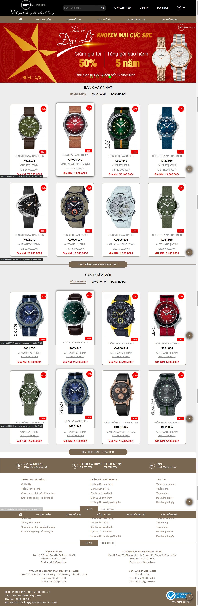
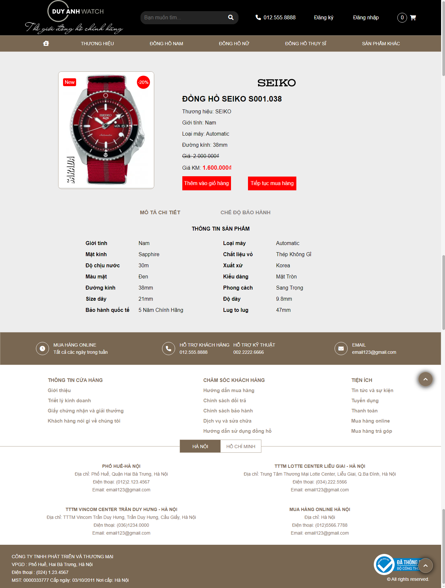
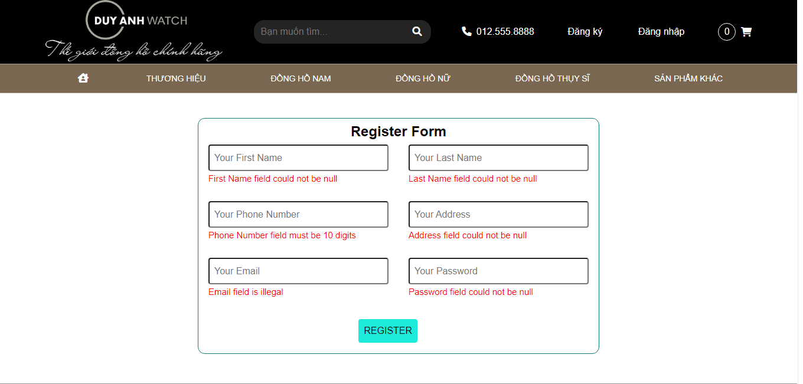
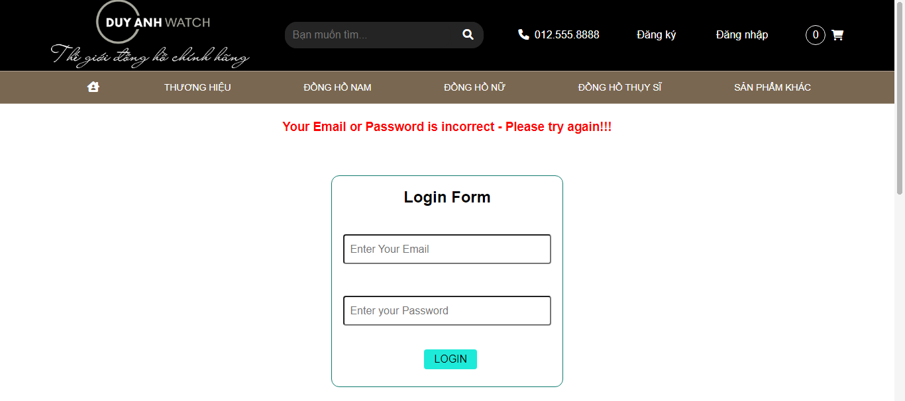
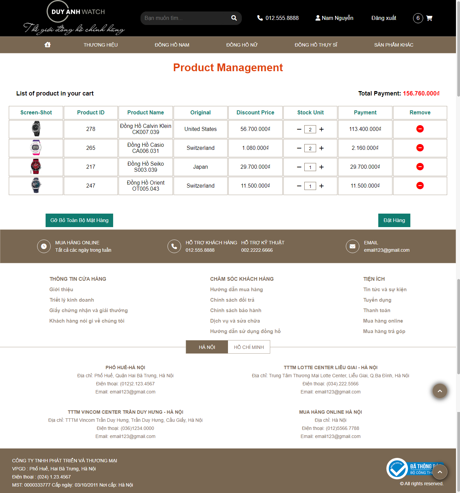
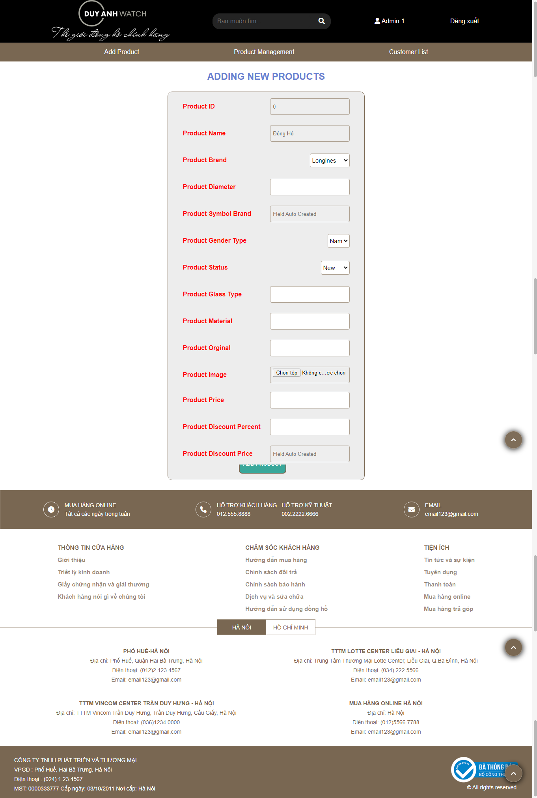
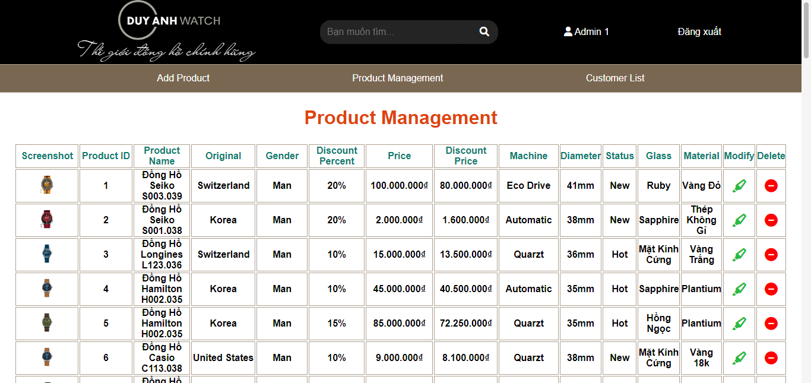
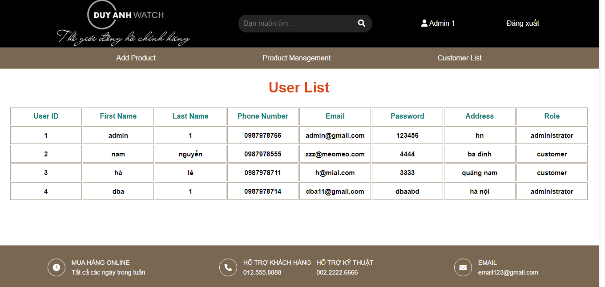

## Watch Store Ecommerce Project  using spring mvc + spring jdbc + jsp

### Functionalities:

* User can sign-up and sign-in with role

* Base on each role which is customer or admin, the website will change according to

* Customer can add, update, delete product in their cart

* Admin can add new, update an existed or delete permenantly product from database

* Admin can view user's information

### Tools:

* Eclipse

* Apache Tomcat 8.5

* JDK 1.8

* Maven 3.8

* Mysql WorkBench 8.0

### Screenshots:

* `Home Page`

* `Filter Product`

* `Product Details`

* `Register Form`

* `Login Form`

* `Customer's Cart`

* `Admin Form Add Product`

* `Admin Product Manager`

* `Admin Display User List`

